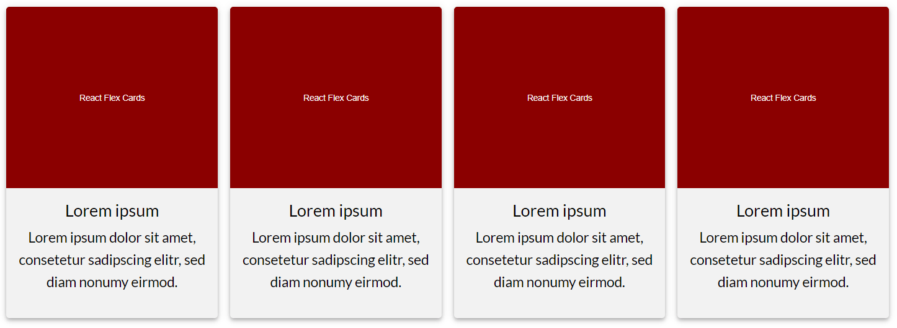

# React Flex Cards

[](https://github.com/peter-stuhlmann/ReactFlexCards/blob/master/LICENSE)

[](https://github.com/peter-stuhlmann/ReactFlexCards/issues?q=is%3Aopen+is%3Aissue)
[](https://github.com/peter-stuhlmann/ReactFlexCards/issues?q=is%3Aissue+is%3Aclosed)



## Installation

```
npm install flex-cards
```

## Minimal setup example

```javascript
const cards = [
  {
    img: {
      src: 'http://example.com/example/img1.jpg',
      alt: 'Lorem ipsum'
    },
    title: 'Lorem ipsum',
    description: 'Lorem ipsum dolor sit amet, consetetur sadipscing elitr.',
    href: 'http://example.com'
  },
  {
    img: {
      src: 'http://example.com/example/img2.jpg',
      alt: 'Lorem ipsum'
    },
    title: 'Lorem ipsum',
    description: 'Lorem ipsum dolor sit amet, consetetur sadipscing elitr.',
    href: 'http://example.com'
  },
  ...
];

<FlexCards cards={cards} />;
```

You can also show iFrames instead of images. This is useful e.g. for YouTube videos. To do this, write the following iFrame object instead of your img object in your data array:

```javascript
  {
    iframe: {
      src: 'https://www.youtube.com/embed/HxM46vRJMZs',
    },
    ...
  }
```

If you enter both img and iframe, the image will be shown by default. You can override that behaviour with the prop `mediaPriority`.

```javascript
<FlexCards cards={cards} mediaPriority="iframe" />
```

If the `mediaPriority` is set to _iframe_ the iFrame will be shown even if there is an image. If there is no iFrame available, the image will still be shown.  
With the prop `noMedia` you can hide images and iFrames. This will override the `mediaPriority` prop.  
With the prop `noTextbox` you can hide the text box below the image or the iFrame.

## Props

With props you have a lot of possibilities to easily customize this module.

| prop             | type    | default                    | notes                                                                                                                                             |
| ---------------- | ------- | -------------------------- | ------------------------------------------------------------------------------------------------------------------------------------------------- |
| cards            | array   |                            | includes data of all cards                                                                                                                        |
| cardColor        | string  | '#f2f2f2'                  | background color of each card                                                                                                                     |
| cardsPerRow      | number  | 4                          | amount of cards per row (on desktop screens)                                                                                                      |
| className        | string  |                            | class to style the whole container with css                                                                                                       |
| containerColor   | string  | '#fff'                     | background color of the whole container                                                                                                           |
| label            | string  | 'Read more'                | text that appears on the image when hovering over a card                                                                                          |
| labelColor       | string  | 'rgba(255, 255, 255, 0.9)' | background color of the label                                                                                                                     |
| noLabel          | boolean | false                      | `true` hides the label                                                                                                                            |
| noTextbox        | boolean | false                      | `true` hides the textbox below the picture                                                                                                        |
| noMedia          | boolean | false                      | `true` hides the image or iframe above the text                                                                                                   |
| mediaPriority    | string  | 'image'                    | if both img and iframe are specified in the data object, the value specified in mediaPriority is shown. (image/iframe)                            |
| mobileBreakpoint | string  | '480px'                    | media breakpoint (mobile devices)                                                                                                                 |
| tabletBreakpoint | string  | '768px'                    | media breakpoint (tablet devices)                                                                                                                 |
| margin           | string  | '8px'                      | value will be used to calculate all margins/paddings in this component                                                                            |
| width            | string  | '100%'                     | width of the whole container; content is centered; accepts the same values as the css width property (some values, e.g. px may not be responsive) |
| maxWidth         | string  | '100%'                     | max width of the whole container; content is centered                                                                                             |

---

## License

Licensed under the [MIT](https://github.com/peter-stuhlmann/ReactFlexCards/blob/master/LICENSE) license by [Peter R. Stuhlmann](https://peter-stuhlmann-webentwicklung.de).
